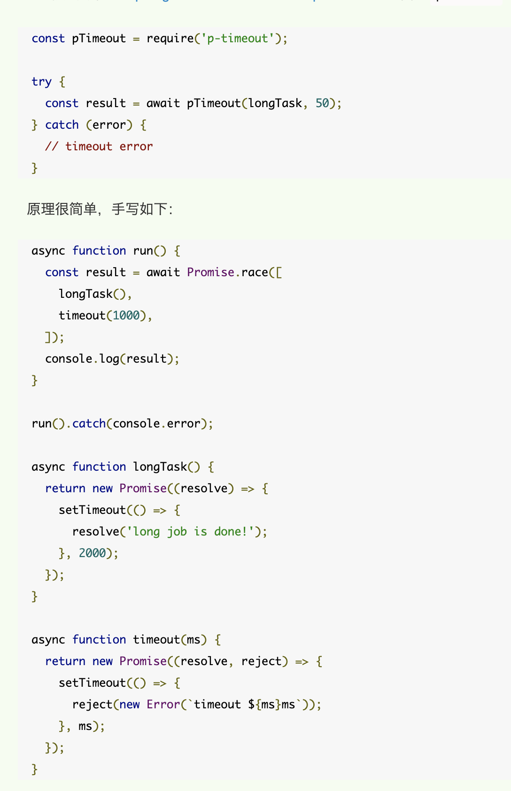

# 面试题搜集

本文是面试准备期间对各种想得到的面试题的搜集

[如何轻松拿到淘宝前端 offer | 掘金技术征文](https://juejin.im/post/5bbc54a2e51d450e5a7445b4#heading-9)

## 其他

https://www.nowcoder.com/discuss/373429

### vuepress + 黑夜模式 暂定 ❌

* CSS新特性prefers-color-scheme可以检测mac or win10的黑夜模式
* 目前大多切换主题都是采用CSS全局替换

### 【vuepress】 vuepress文章（主题继承/路由控制/...）
    https://juejin.im/post/5dc42ebb6fb9a04a9378381c#heading-12

### Mysql 存储引擎的区别和比较

**MyISAM** 如果数据表主要用来插入和查询记录，则MyISAM（但是不支持事务）引擎能提供较高的处理效率

**InnoDB** 默认Mysql引擎，如果要提供提交、回滚、崩溃恢复能力的事务安全（ACID兼容）能力，并要求实现并发控制，InnoDB是一个好的选择

**MEMORY** 如果只是临时存放数据，数据量不大，并且不需要较高的数据安全性，可以选择将数据保存在内存中的Memory引擎，MySQL中使用该引擎作为临时表，存放查询的中间结果。数据的处理速度很快但是安全性不高。

**Archive存储引擎** 如果只有INSERT和SELECT操作，可以选择Archive，Archive支持高并发的插入操作，但是本身不是事务安全的。Archive非常适合存储归档数据，如记录日志信息可以使用Archive


### 项目总结 ❌

* 基于hadlebars搭建的站点
* 水果配送小程序
* 行遇小程序
* 打印H5 + 管理端
* 海报小程序

## 算法

### 排序算法 ❌

### 树

### DFS&&BFS ❌

### DP

## 性能优化： 🌊

1. 防抖/节流
2. CDN
3. gzip或者压缩js或者css(使用webpack插件)
4. 减少http请求数
5. 使用http缓存：设置cache-control,expires,以及E-tag都是不错的（注意加版本号）
6. Webpack打包分割代码
7. 图像压缩/webp格式
8. React.pureComponent && React.memo
9. immutable.js 及其原理
    1. immutable.js实现原理：持久化数据结构，也就是使用旧数据创建新数据时，要保证旧数据同时可用且不变。同时为了避免 deepCopy 把所有节点都复制一遍带来的性能损耗，Immutable 使用了结构共享，即如果对象树中一个节点发生变化，只修改这个节点和受它影响的父节点，其它节点则进行共享。


## 浏览器

### window.onload 这个表示加载完页面所有东西以后才执行，在页面只允许出现一个onload函数，因为它可编函数个数只有一个 && window.load这个只是表明事件方法，但并未执行，比如hover、click表示事件，必须用上hover、onclick他才会执行 && DOMContentLoaded，顾名思义，就是当页面的内容解析完成后，则触发该事件。

### 跨域 ❌

## JS

### 正则 ❌

### 原型链和继承 ❌

### 【ES6】中断或取消Promise链的可行方案
https://blog.csdn.net/ambit_tsai/article/details/80635594

```js
Promise.resolve()
    .then(() => {
        console.log('[onFulfilled_1]');
        throw 'throw on onFulfilled_1';
    })
    .then(() => {  // 中间的函数不会被调用
        console.log('[onFulfilled_2]');
    })
    .catch(err => {
        console.log('[catch]', err);
    });
// => [onFulfilled_1]
// => [catch] throw on onFulfilled_1
```

promise 的状态改变为 rejected 后，promise 就会跳过后面的 then 方法
然而，若链路中也对错误进行了捕获，则后续的函数可能会继续执行。

```js
Promise.resolve()
    .then(() => {
        console.log('[onFulfilled_1]');
        throw 'throw on onFulfilled_1';
    })
    .then(() => {
        console.log('[onFulfilled_2]');
    }, err => {     // 捕获错误
        console.log('[onRejected_2]', err);
    })
    .then(() => {   // 该函数将被调用
        console.log('[onFulfilled_3]');
    })
    .catch(err => {
        console.log('[catch]', err);
    });
// => [onFulfilled_1]
// => [onRejected_2] throw on onFulfilled_1
// => [onFulfilled_3]
```

Promise的then方法接收两个参数：
Promise.prototype.then(onFulfilled, onRejected)，若onFulfilled或onRejected是一个函数，当函数返回一个新Promise对象时，原Promise对象的状态将跟新对象保持一致

```js
Promise.resolve()
    .then(() => {
        console.log('[onFulfilled_1]');
        return new Promise(()=>{}); // 返回“pending”状态的Promise对象
    })
    .then(() => {                   // 后续的函数不会被调用
        console.log('[onFulfilled_2]');
    })
    .catch(err => {
        console.log('[catch]', err);
    });
// => [onFulfilled_1]
```

### ASYNC/AWAIT && Promise 取消

return一个空的promise

如果对象是Promise对象相互竞争，则可以使用[Promise.race](https://es6.ruanyifeng.com/#docs/promise#Promise-race)进行操作：
比如：


### 【js】 防抖/节流 ❌

### 【ES6】 generators ❌

### 【ES7/8/9新特性】

https://segmentfault.com/a/1190000017174508

#### ES7 

* Array.prototype.includes()

* ### **

#### ES8

* Async/Await
* Atomics？？？
* Object.values && Object.entries
  * Object.values() 方法返回一个给定对象自己的所有可枚举属性值的数组，值的顺序与使用for...in循环的顺序相同 ( 区别在于for-in循环枚举原型链中的属性 )
  * Object.entries 方法返回一个给定对象自身可遍历属性 [key, value] 的数组， 排序规则和 Object.values 一样。
* String padding 这几个函数的主要目的就是填补字符串的首部和尾部，为了使得到的结果字符串的长度能达到给定的长度
* Object.getOwnPropertyDescriptors 见如下

### 【ES8】 了解ES8吗？说说getOwnPropertyDescriptors函数，对象自身属性描述符有哪些

getOwnPropertyDescriptors 方法返回指定对象所有自身属性的描述对象。属性描述对象是直接在对象上定义的，而不是继承于对象的原型。ES2017加入这个函数的主要动机在于方便将一个对象深度拷贝给另一个对象，同时可以将getter/setter拷贝。

**writable**

当且仅当属性的值可以被改变时为true。(仅针对数据属性描述有效)

**get**

获取该属性的访问器函数（getter）。如果没有访问器， 该值为undefined。(仅针对包含访问器或设置器的属性描述有效)

**set**

获取该属性的设置器函数（setter）。 如果没有设置器， 该值为undefined。(仅针对包含访问器或设置器的属性描述有效)

**configurable**

当且仅当指定对象的属性描述可以被改变或者属性可被删除时，为true。

**enumerable**

当且仅当指定对象的属性可以被枚举出时，为 `true`。

**`Object.defineProperty()`** 方法会直接在一个对象上定义一个新属性，或者修改一个对象的现有属性， 并返回这个对象。

### 【js】 js执行会阻塞DOM树的解析和渲染，那么css加载会阻塞DOM树的解析和渲染吗
https://juejin.im/post/5b88ddca6fb9a019c7717096
css加载不会阻塞DOM树的解析
css加载会阻塞DOM树的渲染
css加载会阻塞后面js语句的执行

## CSS

### CSS选择器 ❌

### 【css】 圣杯布局、双飞翼布局 ❌

### 什么是BFC，作用有哪些？哪些情况下会触发BFC

BFC（块级格式化上下文），是页面上的一个隔离的独立容器，容器里面的子元素不会影响到外面元素，反之亦然。它与普通的块框类似，但不同之处在于:
（1）可以阻止元素被浮动元素覆盖。
（2）可以包含浮动元素。
（3）可以阻止margin重叠。
满足下列条件之一就可触发BFC：
【1】根元素，即HTML元素
【2】float的值不为none
【3】overflow的值不为visible
【4】display的值为inline-block、table-cell、table-caption
【5】position的值为absolute或fixed

### 【CSS】 只用CSS怎样实现标签页的切换效果
利用锚点结合CSS的target伪类就可以了

## HTTP

### 【http】 http2.0 ❌

### 304缓存，有了Last-Modified，为什么还要用ETag？有了Etag，为什么还要用Last-Modified？Etag一般怎么生成？

有了Last-Modified，为什么还要用ETag？
（1）因为如果在一秒钟之内对一个文件进行两次更改，Last-Modified就会不正确。
（2）某些服务器不能精确的得到文件的最后修改时间。
（3）一些文件也许会周期性的更改，但是他的内容并不改变(仅仅改变的修改时间)，这个时候我们并不希望客户端认为这个文件被修改了，而重新GET。
有了Etag，为什么还要用Last-Modified？
因为有些时候 ETag 可以弥补 Last-Modified 判断的缺陷，但是也有时候 Last-Modified 可以弥补 ETag 判断的缺陷，比如一些图片等静态文件的修改，如果每次扫描内容生成 ETag 来比较，显然要比直接比较修改时间慢很多。所有说这两种判断是相辅相成的。

ETag的值是服务端对文件的索引节，大小和最后修改时间进行Hash后得到的。

## React

### 【React】 pureComponent & Component 【性能优化】

https://juejin.im/entry/5934c9bc570c35005b556e1a

当组件更新时，如果组件的 props 和 state 都没发生改变，render 方法就不会触发，省去 Virtual DOM 的生成和比对过程，达到提升性能的目的。具体就是 React 自动帮我们做了一层浅比较：

```js
if (this._compositeType === CompositeTypes.PureClass) {
  shouldUpdate = !shallowEqual(prevProps, nextProps)
  || !shallowEqual(inst.state, nextState);
}
```

而 shallowEqual 又做了什么呢？会比较 Object.keys(state | props) 的长度是否一致，每一个 key是否两者都有，并且是否是一个引用，也就是只比较了第一层的值，确实很浅，所以深层的嵌套数据是对比不出来的。

PureComponent真正起作用的，只是在一些纯展示组件上，复杂组件用了也没关系，反正shallowEqual那一关就过不了，不过记得 props 和 state 不能使用同一个引用哦。

果 PureComponent 里有 shouldComponentUpdate 函数的话，直接使用 shouldComponentUpdate 的结果作为是否更新的依据，没有shouldComponentUpdate 函数的话，才会去判断是不是 PureComponent ，是的话再去做 shallowEqual浅比较


### 【React】 [React.memo()](https://zh-hans.reactjs.org/docs/react-api.html#reactmemo)

React.memo 为高阶组件。它与 React.PureComponent 非常相似，但它适用于函数组件，但不适用于 class 组件。

React.memo only affects props changes. If your function component wrapped in React.memo has a useState or useContext Hook in its implementation, it will still rerender when state or context change.

因为memo只进行浅比较，可以自行实现函数进行比较
```js
function MyComponent(props) {
  /* render using props */
}
function areEqual(prevProps, nextProps) {
  /*
  return true if passing nextProps to render would return
  the same result as passing prevProps to render,
  otherwise return false
  */
}
export default React.memo(MyComponent, areEqual);
```


### 【Redux】 纯函数 & reducer ❌

### 【React】 react.lazy & suspense 

原理解析：https://zhuanlan.zhihu.com/p/58979795

React.lazy 和 Suspense 技术还不支持服务端渲染。如果你想要在使用服务端渲染的应用中使用，我们推荐 Loadable Components 这个库。

可以不借助任何附加库就能通过代码分割（code splitting）延迟加载 react 组件。延迟加载是一种优先渲染必须或重要的用户界面项目，而将不重要的项目悄然载入的技术。先前有react-loadable实现。

```js
const OtherComponent = React.lazy(() => import('./OtherComponent'));

function MyComponent() {
  return (
    <div>
      <OtherComponent />
    </div>
  );
}
```

Suspense 是一个延迟函数所必须的组件，通常用来包裹住延迟加载组件。多个延迟加载的组件可被包在一个 suspense 组件中。它也提供了一个 fallback 属性，用来在组件的延迟加载过程中显式某些 react 元素。

同时最好使用一个边界异常捕获技术来处理错误

```js
const OtherComponent = React.lazy(() => import('./OtherComponent'));

function MyComponent() {
  return (
    <div>
      <Suspense fallback={<div>Loading...</div>}>
        <OtherComponent />
      </Suspense>
    </div>
  );
}
```

### 【React】 Context 

https://juejin.im/post/5a90e0545188257a63112977

Context 提供了一种在组件之间共享此类值的方式，而不必显式地通过组件树的逐层传递 props。比如Redux或者传递主题的属性。

他回导致组件复用性变差，使用前需要思考可否用组合组件或者传递组件来替代它

生产者消费者模式：`<Provider /> & <Consumer />`

除了实例的`context`属性(`this.context`)，React组件还有很多个地方可以直接访问父组件提供的`Context`

### 【React】 Hooks ❌

### 【数据绑定】 Angular和Vue的双向数据绑定实现的原理？
> Angular的实现： AngularJS 采用“脏值检测”的方式，数据发生变更后，对于所有的数据和视图的绑定关系进行一次检测，识别是否有数据发生了改变，有变化进行处理，可能进一步引发其他数据的改变，所以这个过程可能会循环几次，一直到不再有数据变化发生后，将变更的数据发送到视图，更新页面展现。
只有当改变$scope的值、使用内置的$interval、$timeout的时候，才会进行“脏检测”。
如果是手动对 ViewModel 的数据进行变更，为确保变更同步到视图，需要手动触发一次“脏值检测”。
Vue的实现：核心就是数据劫持+发布/订阅模式，VueJS 使用 ES5 提供的 Object.defineProperty() 方法，监控对数据的操作，从而可以自动触发数据同步。并且，由于是在不同的数据上触发同步，可以精确的将变更发送给绑定的视图，而不是对所有的数据都执行一次检测。

## Node

### 【Node】 nodejs子进程 spawn，exec，execFile和fork的用法和区别
spawn函数用给定的命令发布一个子进程，只能运行指定的程序，参数需要在列表中给出。
exec也是一个创建子进程的函数，与spawn函数不同它可以直接接受一个回调函数作为参数，回调函数有三个参数，分别是err, stdout , stderr。
execFile函数与exec函数类似，但execFile函数更显得精简，因为它可以直接执行所指定的文件。
fork函数可直接运行Node.js模块，我们可以直接通过指定模块路径而直接进行操作

### 【Node】 nodejs中定时器函数process.nextTick和setImmediate的区别，优先级
process.nextTick()的回调函数执行的优先级要高于setImmediate()。
process.nextTick()属于idle观察者,setImmediate()属check观察者,在每一轮循环检查中,idle观察者先于I/O观察者,I/O观察者先于check观察者。
process.nextTick()的回调函数保存在一个数组中，会将异步回调放到当前帧的末尾、io回调之前，如果nextTick过多，会导致io回调不断延后,最后callback堆积太多。setImmediate()的结果则是保存在链表中，会将异步回调放到下一帧,不影响io回调,不会造成callback 堆积。
process.nextTick()在每轮循环中会将数组中的回调函数全部执行完，而setImmediate()在每轮循环中执行链表中的一个回调函数。
process.nextTick()，效率最高，消费资源小，但会阻塞CPU的后续调用；
setTimeout()，精确度不高，可能有延迟执行的情况发生，且因为动用了红黑树，所以消耗资源大；
setImmediate()，消耗的资源小，也不会造成阻塞，但效率也是最低的。

### Koa2和Koa1的区别，和express的区别

（1）异步流程控制
Express 采用 callback 来处理异步，Koa v1 采用 generator，Koa v2 采用 async/await。
generator 和 async/await 使用同步的写法来处理异步，明显好于 callback 和 promise，async/await 在语义化上又要比 generator 更强。
（2）错误处理
Express 使用 callback 捕获异常，对于深层次的异常捕获不了，Koa 使用 try catch，能更好地解决异常捕获。

## Typescript

### 【Typescript】 Typescript in React

## Webpack

### 【webpack】 happypack的使用 

* Happypack 的作用就是将文件解析任务分解成多个子进程并发执行。子进程处理完任务后再将结果发送给主进程。
* 区分进程、线程的差异
* webpack4以上建议使用thread-loader

## 其他引用

https://juejin.im/entry/59a27300f265da2495179140